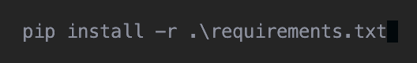

# maze-game
maze game

  
# HOW TO SET UP YOUR RASBERRY PI.

Frist install rasberry pi os on an sd card.

Then install python.

Clone the maze game.

Connect the neopixels to pin 6 on your rasberry pi.

Install all requirements from requirements.txt.

By:

 
 
In your terminal.

Now run the code.

Happy gaming 😎.
